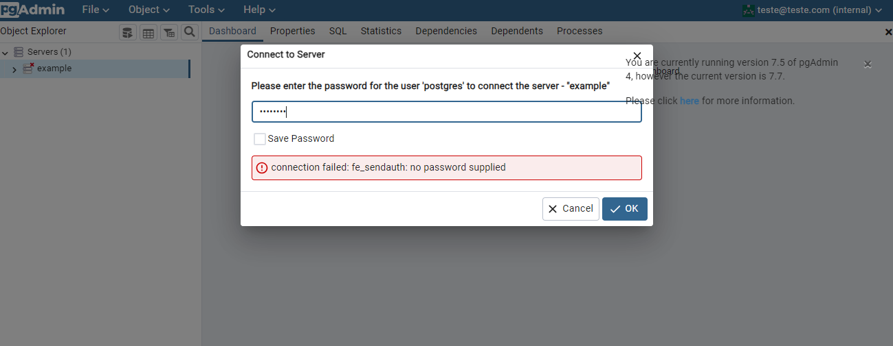

# PostgreSQL instance with pgAdmin using Docker Compose

This repository contains an example of how to set up a PostgreSQL instance with pgAdmin using Docker Compose.

## Prerequisites

- Docker
- Docker Compose

## Running the application

1. Clone this repository:

```
git clone https://github.com/your-username/postgresql-pgadmin-docker-compose.git
```

2. Navigate to the cloned repository:

```
cd postgresql-pgadmin-docker-compose
```

3. Run the following command to start the PostgreSQL instance and pgAdmin:

```
docker-compose up
```

4. Access pgAdmin by opening a web browser and navigating to `http://localhost:16543`. Log in with the email and password specified in the `docker-compose.yml` file.

## Personalizing the application

You can personalize the application by changing the environment variables in the `docker-compose.yml` file. The following environment variables are available:

- `POSTGRES_USER`: The username for the PostgreSQL instance. Default is `postgres`.
- `POSTGRES_PASSWORD`: The password for the PostgreSQL instance. Default is `postgres`.
- `PGADMIN_DEFAULT_EMAIL`: The email address for the pgAdmin user. Default is `teste@teste.com`.
- `PGADMIN_DEFAULT_PASSWORD`: The password for the pgAdmin user. Default is `teste`.

## Accessing the PostgreSQL database

1. Log in to pgAdmin by opening a web browser and navigating to `http://localhost:16543`.

2. Click on the `Servers` item in the left sidebar.
3. This popup should open asking for the password of the database:

4. Enter the password specified in the POSTGRES_PASSWORD environment variable in the `docker-compose.yml` file and click on `OK`.

